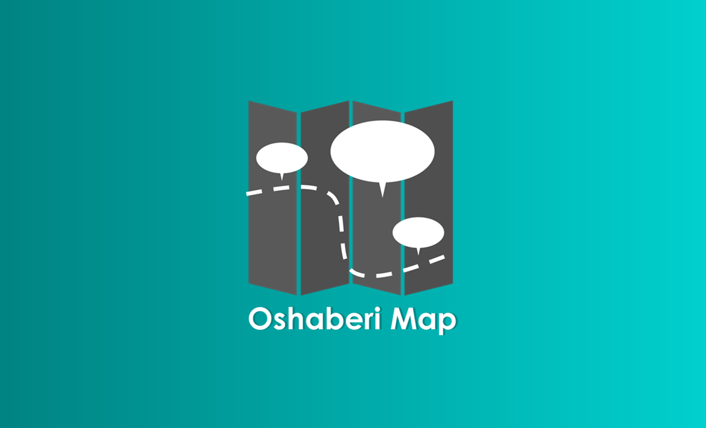
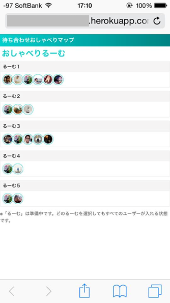

# Oshaberi Map

Socket I/Oでメッセージと現在地をリアルタイムに共有してすれ違いのない待ち合わせを実現しよう(｀・ω・´)

[Demo](http://machiawase-map-demo.herokuapp.com/)

## How to use?

1. [Facebook Developers](https://developers.facebook.com/)でアプリを登録してIDを取得

1. Testersにテストユーザーを追加

1. views/index.ejsのアプリIDを上書き `appId      : '<アプリID>'`

1. Node.js 環境の Heroku にデプロイして実行してみて。

* [Getting Started with Node.js on Heroku | Deploy the app](https://devcenter.heroku.com/articles/getting-started-with-nodejs#deploy-the-app)

## What's room?

るーむとはチャットルームであり地図でもあります。

るーむのリストはMessengerのグループと連動しているので、グループのメンバーでのみシェアできます。最近更新された5つのグループがるーむとして表示されます。

## Resources

* [Leaflet](https://developers.arcgis.com/javascript/)
* [Bootstrap](http://getbootstrap.com/)
* [jQuery](https://jquery.com/)
* [socket.io](http://socket.io/)

## License
Copyright 2015 Yusuke Nunokawa.

Apache License Version 2.0（「本ライセンス」）に基づいてライセンスされます。あなたがこのファイルを使用するためには、本ライセンスに従わなければなりません。本ライセンスのコピーは下記の場所から入手できます。

> http://www.apache.org/licenses/LICENSE-2.0

適用される法律または書面での同意によって命じられない限り、本ライセンスに基づいて頒布されるソフトウェアは、明示黙示を問わず、いかなる保証も条件もなしに「現状のまま」頒布されます。本ライセンスでの権利と制限を規定した文言については、本ライセンスを参照してください。

ライセンスのコピーは本リポジトリの[ライセンス ファイル](./LICENSE)で利用可能です。

