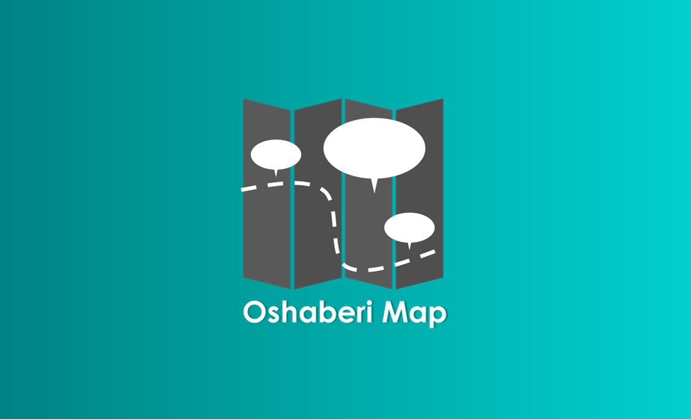
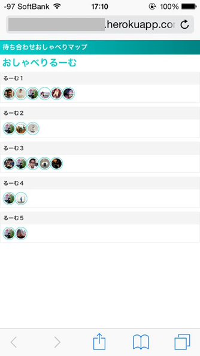

# Oshaberi Map

On the machiawase-map, you can always meet somebody (Facebook Friends only) at somewhere and share your message and location.

## How to use?

1. Register the app and get the app id in [Facebook Developers](https://developers.facebook.com/)

1. Add Testers for the app.

1. Overwrite `appId      : '<App ID>'` in views/index.ejs.

1. Let's deploy the app into heroku with Node.js.

* [Getting Started with Node.js on Heroku | Deploy the app](https://devcenter.heroku.com/articles/getting-started-with-nodejs#deploy-the-app)

## What's room?

Room is a chat room and a map.

The room list is generated based on latest 5 groups on Messenger. So it is only a group member that you can communicate on a room.

## Resources

* [Leaflet](https://developers.arcgis.com/javascript/)
* [Bootstrap](http://getbootstrap.com/)
* [jQuery](https://jquery.com/)
* [socket.io](http://socket.io/)

## License
Copyright 2015 Yusuke Nunokawa.

Licensed under the Apache License, Version 2.0 (the "License");
you may not use this file except in compliance with the License.
You may obtain a copy of the License at

   http://www.apache.org/licenses/LICENSE-2.0

Unless required by applicable law or agreed to in writing, software
distributed under the License is distributed on an "AS IS" BASIS,
WITHOUT WARRANTIES OR CONDITIONS OF ANY KIND, either express or implied.
See the License for the specific language governing permissions and
limitations under the License.

A copy of the license is available in the repository's [license.txt](/license.txt) file.
